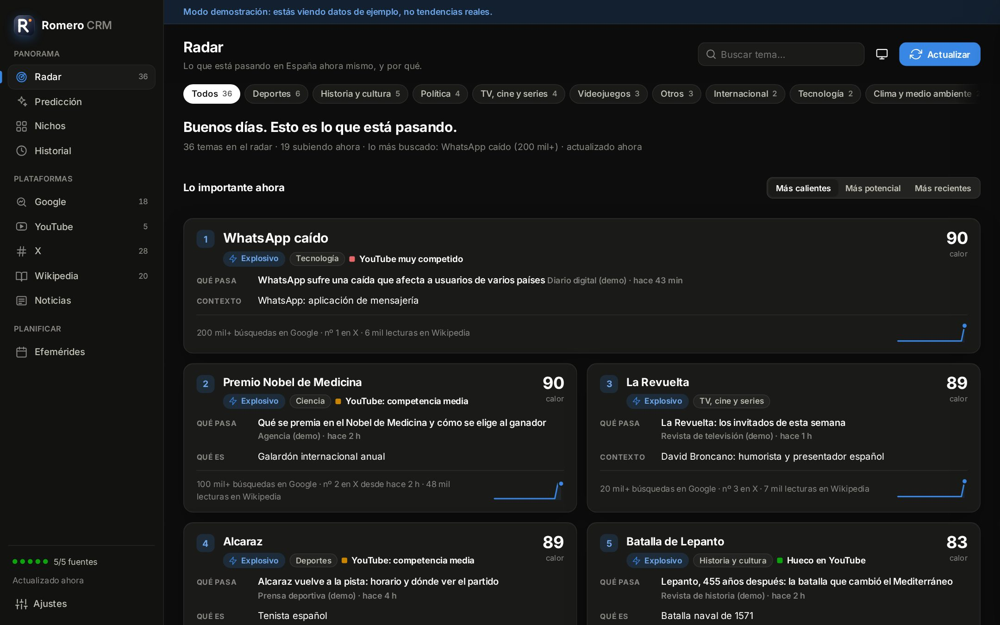
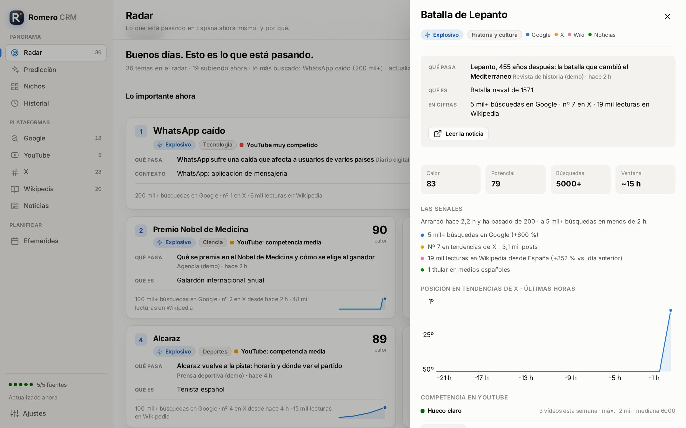

# Romero CRM

Radar de tendencias de España para creadores de contenido. Junta en una sola ventana lo que se busca, se comenta y se lee **ahora mismo** en Google, X, Wikipedia y los medios. Clasifica cada tema por nicho, mide su calor, estima cuánto recorrido le queda y te dice si en YouTube hay hueco para un vídeo sobre él.

Es gratuito, funciona en tu ordenador y no necesita cuentas ni claves de API.



> Las capturas usan **datos de demostración**. Con el programa abierto en tu Mac verás las tendencias reales.

## Qué tiene

| Sección | Para qué sirve |
|---|---|
| **Radar** | **Lo importante ahora**, explicado: cada tema dice **qué pasa** (el titular que explica por qué es tendencia), **qué es** si no es evidente (por ejemplo, quién es una persona o qué es un partido) y sus cifras en una frase («100 mil+ búsquedas en Google · nº 2 en X desde hace 2 h · lo cuentan 5 medios»). Si algo es tendencia en Google, X y Wikipedia a la vez, aparece una sola vez con todas sus señales, y las tendencias sueltas de X se enlazan con su historia principal como **ángulos**. |
| **Predicción** | Qué temas tienen recorrido, con su «qué pasa» y «qué es», el motivo concreto («ha pasado de 20 mil+ a 100 mil+ búsquedas en menos de 2 h») y el **margen para publicar** según cuánto suelen durar las tendencias de ese nicho. Abajo, los aniversarios que conviene preparar con antelación. |
| **Nichos** | Qué está pasando hoy en cada temática (deportes, política, historia, TV…), con sus tres temas principales y si el nicho está más activo o más flojo que de costumbre. |
| **Historial** | Lo más buscado cada día y lo que enseña tu historial: a qué hora suelen arrancar las tendencias, cuánto duran y qué temas vuelven. |
| **Google** | Tendencias de búsqueda de las últimas 24 h, con volumen, subida y búsquedas relacionadas. |
| **YouTube** | Para cada tema caliente, cuántos vídeos **sobre ese tema** se han subido esta semana y cuántas visualizaciones tienen: **hueco claro**, competencia moderada o muy competido. Solo cuentan los vídeos que nombran el tema (para personas, nombre y apellido), y si hay riesgo de confusión busca con contexto («Ángel Arroyo ciclista»). |
| **X** | Tendencias de X en España, con cuánto tiempo llevan y su posición hora a hora en las últimas 8 horas. |
| **Wikipedia** | Los artículos más leídos desde España: una pista de lo que la gente quiere entender a fondo. |
| **Noticias** | **Las historias del día**: lo que más medios cuentan y además es tendencia. Debajo, lo que cubren varios medios pero aún no está en el radar. Las secciones completas quedan plegadas. |
| **Efemérides** | Qué pasó tal día como hoy y los aniversarios redondos de los próximos 30 días (25, 50, 100, 250 años…), con prioridad a los de España. |

Al pulsar un tema se abre su ficha: qué pasa, qué es, sus cifras, las señales de cada plataforma, la curva de interés, más titulares, competencia en YouTube, búsquedas relacionadas y un **brief listo para pegar en Claude** y pedirle ángulos para un guion.

En **Ajustes** puedes poner tu nombre para que el radar te salude.



## Cómo instalarlo en tu Mac

### Instalar (una sola vez)

1. Abre la aplicación **Terminal**: pulsa **⌘ + espacio**, escribe `Terminal` y pulsa **Intro**.
2. Copia esta línea entera, pégala en Terminal (**⌘ + V**) y pulsa **Intro**:

   ```
   curl -fsSL https://raw.githubusercontent.com/contactodaviidromero99/content/main/romero-crm/scripts/instalar.sh | bash
   ```

3. Espera. La primera vez tarda 1-2 minutos. Al terminar verás Romero CRM en tu carpeta Aplicaciones y el programa se abrirá solo.

Si macOS te pide instalar las **«herramientas de línea de comandos»**, pulsa *Instalar*, acepta y espera a que acabe (unos minutos). Después repite el paso 2. Son de Apple y traen Python, que es lo que necesita Romero CRM.

### Abrirlo cualquier día

Pulsa **⌘ + espacio**, escribe `Romero` y pulsa **Intro**. También está en Launchpad.

### Actualizarlo

Cierra Romero CRM y repite el paso 2. Tu historial no se borra.

### Sin Terminal (alternativa)

1. En GitHub, pulsa **Code → Download ZIP** y descomprímelo.
2. Abre la carpeta `romero-crm` y haz **clic derecho → Abrir** sobre **`Abrir Romero CRM.command`**. La primera vez macOS pregunta porque el archivo viene de internet. Si no te deja, ve a **Ajustes del Sistema → Privacidad y seguridad** y pulsa **Abrir igualmente**.

### Versión en el navegador

Si prefieres usarlo en el navegador en lugar de en su propia ventana, pega esto en Terminal:

```
bash ~/"Romero CRM"/scripts/run.sh --web
```

Se abrirá en `http://127.0.0.1:8765`. Para cerrarlo, pulsa **Ctrl + C** en Terminal.

## Sin la nube

Romero CRM funciona entero en tu ordenador: no depende de Claude ni de ningún servidor propio. Necesita **internet** para descargar las tendencias, pero el historial se guarda en tu Mac y lo puedes consultar aunque te quedes sin conexión.

Tus datos están en `~/Library/Application Support/Romero CRM/`. Desde **Ajustes** puedes borrar el historial.

## Fuentes y límites, sin adornos

| Fuente | Cómo se obtiene | Fiabilidad |
|---|---|---|
| Google Trends | Datos públicos de *Trending Now* (España), con respaldo por RSS. La evolución del volumen la registra el propio programa | Alta |
| Wikipedia | API oficial de Wikimedia: lo más leído desde España | Alta |
| Google News | RSS público por secciones | Alta |
| Efemérides | API oficial de Wikipedia «tal día como hoy» | Alta |
| X (Twitter) | getdaytrends.com (principal) y trends24.in (respaldo); la API de X es de pago | Media: son webs de terceros |
| YouTube | Búsqueda pública de vídeos de la última semana | Media |

- **Las explicaciones no se inventan.** «Qué pasa» es un titular real de un medio que nombra el tema; «qué es» es la descripción de Wikipedia, y solo se muestra si corresponde de verdad al tema (mismo nombre y misma temática). Si no hay ninguna fiable, el programa lo dice en lugar de adivinar.
- **TikTok no está.** Sus tendencias (Creative Center) ahora solo se ven con cuenta de TikTok One, y Romero CRM no usa tu cuenta ni tu contraseña. En la ficha de cada tema tienes un enlace para buscarlo en TikTok.
- **Instagram y Facebook no publican tendencias**, ni gratis ni pagando. Para formato vertical, la mejor aproximación es cruzar el Radar con lo que veas en TikTok con tu cuenta.
- **Google ya no deja descargar la curva de cada tendencia.** Por eso Romero CRM apunta el volumen de cada tendencia en cada actualización y dibuja su propia curva. Las primeras horas verás pocas curvas; cuanto más tiempo tengas el programa abierto, más completas serán.
- **YouTube eliminó su página de Tendencias en julio de 2025.** Por eso la sección de YouTube mide competencia en lugar de mostrar «lo más visto».
- Si una fuente falla, el resto sigue funcionando y en **Ajustes → Estado de las fuentes** verás el motivo.
- La **predicción** son estimaciones transparentes, no adivinación. Se basan en el crecimiento, en cómo cambia el volumen registrado, en la posición en X, en la presencia en varias plataformas y en la duración típica por nicho calculada con tu propio historial. Úsala para priorizar.
- Cuanto más tiempo tengas el programa abierto, más historial acumula y mejores son las estimaciones de duración.

## Para desarrolladores

```
romero-crm/
├── Abrir Romero CRM.command      lanzador para Mac
├── Instalar en Aplicaciones.command
├── scripts/run.sh                prepara el entorno y arranca
├── romero_crm/
│   ├── app.py                    ventana nativa (pywebview) o navegador
│   ├── server.py                 servidor local + API JSON
│   ├── engine.py                 actualizaciones programadas
│   ├── analysis.py               fusión multiplataforma, calor, fases, ventanas
│   ├── explain.py                qué pasa, qué es y cifras en palabras
│   ├── niches.py                 clasificación por nichos
│   ├── storage.py                historial en SQLite
│   ├── sources/                  una fuente por archivo
│   └── web/                      interfaz (HTML, CSS y JS sin dependencias)
└── tests/
```

- Pruebas: `python3 -m unittest discover -s tests`
- Modo demostración (datos de ejemplo, sin internet): `python3 -m romero_crm --demo --web`
