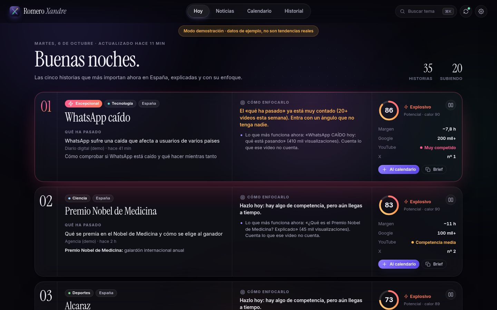
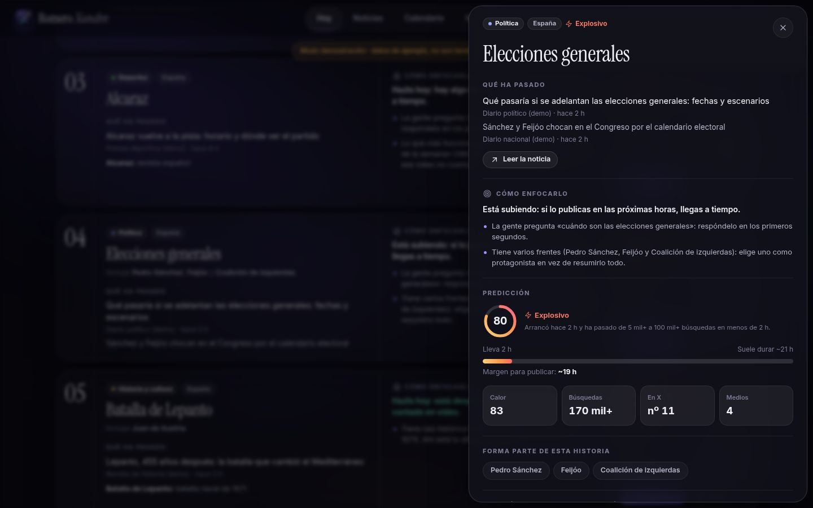
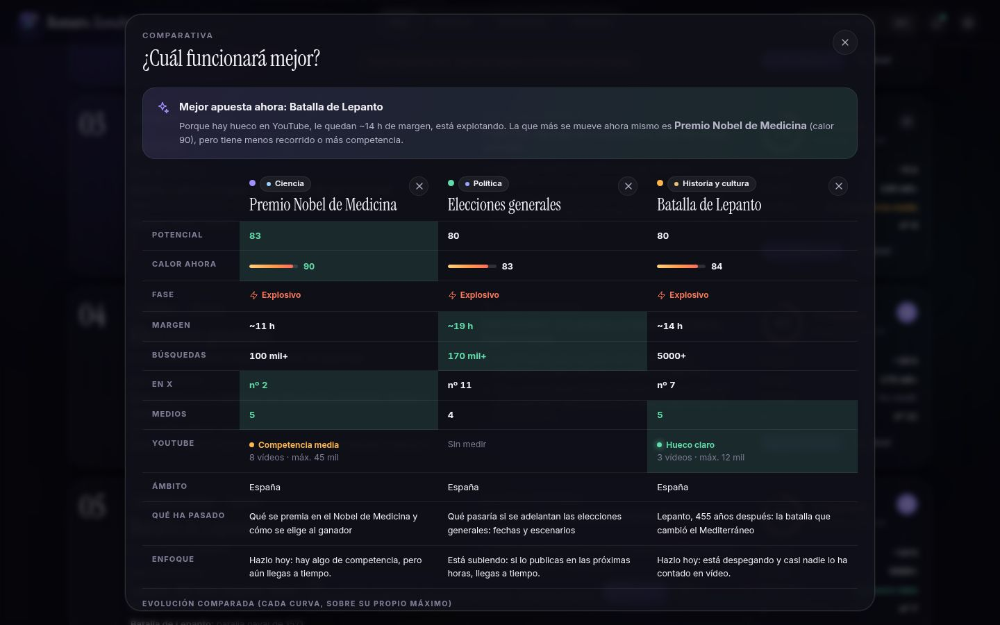
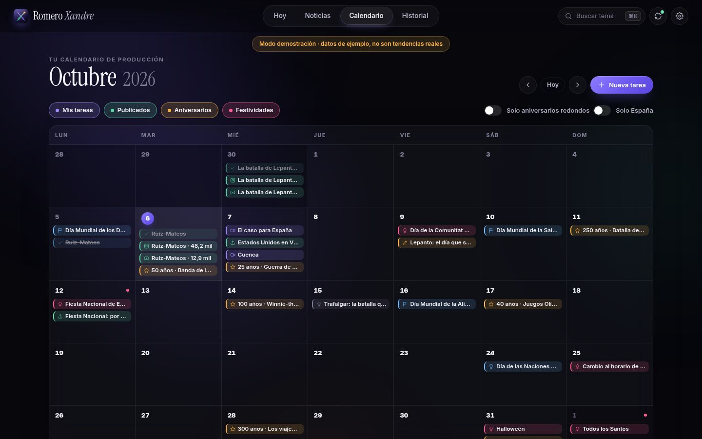
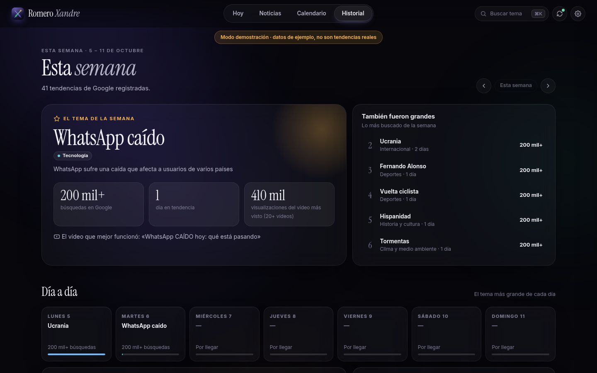

# Romero Xandre CRM

Tu programa de trabajo para hacer vídeos: al abrirlo ves **las cinco historias que más importan ahora en España**, qué ha pasado en cada una y **cómo enfocar el vídeo**; al lado, **tu calendario** de grabaciones y publicaciones, con los aniversarios y fiestas que merecen un vídeo.

Es gratuito, funciona en tu Mac y no necesita cuentas. Conectar tus redes y las ideas con Claude son opcionales.



> Las capturas usan **datos de demostración**. Con el programa abierto en tu Mac verás lo que pasa de verdad.

## Qué tiene

| Sección | Para qué sirve |
|---|---|
| **Hoy** | Lo primero que ves. Las **cinco historias más calientes**, con prioridad para España: **qué ha pasado** (el titular real que lo explica), **cómo enfocarlo** y la **predicción** (potencial, fase, margen para publicar, búsquedas en Google y si hay hueco en YouTube). Si pasa algo excepcional, en España o en el mundo, sale primero y marcado como **Excepcional**. Debajo, **tu día** (lo que toca grabar o publicar, con su tic) y **lo que viene**: aniversarios y fechas de las próximas semanas con idea de vídeo. |
| **Noticias** | Todas las historias, **clasificadas por nichos** (política, TV, cine y series, deportes, historia…), con filtro España / Mundo, buscador y orden por importancia, calor, potencial o novedad. La pestaña **En los medios** enseña lo que cuentan los periódicos aunque aún no sea tendencia. |
| **Calendario** | Un calendario de verdad, mes a mes. Tus tareas (**publicar, grabar, editar, guion, idea**) con su tic, tus vídeos publicados con sus visualizaciones, las **festividades** de España y los **aniversarios** que merecen un vídeo, con filtros de *solo redondos* y *solo España*. Pulsa un día para ver el detalle y planificar un vídeo con un clic. |
| **Historial** | La semana en un vistazo: el **tema de la semana** (y cómo funcionaron los vídeos sobre él en YouTube), lo más grande de cada día, qué **nichos** subieron o bajaron, **a qué hora** arrancan las tendencias y tus vídeos de la semana. |
| **Ajustes** | Tu nombre, apariencia, fuentes (se pueden desactivar), **tus redes** y las **ideas con Claude**. |

Y en cualquier sitio:

- **Ficha de cada historia**: todo lo necesario para el vídeo (qué ha pasado, contexto, enfoque, predicción con su margen, qué temas incluye, evolución, titulares, competencia en YouTube, lo que busca la gente) y un **brief listo para pegar en Claude** y pedirle el guion.
- **Comparativa**: marca dos, tres o cuatro historias y compáralas lado a lado; te dice **cuál es la mejor apuesta ahora** y por qué.
- **Búsqueda rápida**: pulsa **⌘K** (o la lupa) y escribe cualquier tema.

| Ficha de una historia | Comparativa |
|---|---|
|  |  |

| Calendario | Historial |
|---|---|
|  |  |

## Cómo elige y explica las historias

- **Agrupa lo que es lo mismo.** Si «Pedro Sánchez», «Feijóo», «Coalición de izquierdas» y «Elecciones generales» son tendencia a la vez porque hablan de lo mismo, salen como **una sola historia** («Elecciones generales», que incluye a las demás). Se agrupan cuando comparten titulares, búsquedas relacionadas o se nombran entre sí, nunca solo por parecerse.
- **España primero.** Las historias con protagonistas o lugares españoles suben en la portada; las de fuera necesitan ser más grandes para entrar, salvo que sean excepcionales.
- **Excepcional** es raro a propósito: muchísimas búsquedas (más de 200 000 en España, 500 000 si es internacional), presencia en X o en muchos medios, varias plataformas a la vez y que acabe de pasar.
- **Lo rutinario baja**: los partidos («Real Madrid - Villarreal») y los programas de cada semana se ven en Noticias, pero no ocupan la portada salvo que estén enormes.
- **Qué ha pasado** es siempre un titular real de un medio (y un segundo de otro medio si aporta algo). Nada se inventa: si no hay titulares, lo dice.
- **Cómo enfocarlo** sale de los datos: el momento (si está despegando, en su techo o apagándose), la competencia en YouTube, lo que pregunta la gente en Google («cuándo son las elecciones…»), el vídeo que más funciona ahora sobre ese tema, si tiene raíz histórica o si coincide con un aniversario.
- **Ideas con Claude (opcional).** Con una clave de la API de Claude (Ajustes), cada historia de la portada trae además un resumen, un enfoque narrativo y un posible gancho escritos por Claude (Claude Opus 5.5) a partir de esos mismos datos. Cada historia se pide una sola vez mientras no cambie, así que cuesta céntimos. Sin clave no se hace ninguna llamada.

## Tus redes

| Red | Cómo se conecta | Qué trae |
|---|---|---|
| **YouTube** | Escribe tu @canal en Ajustes. Sin claves. | Tus vídeos (también Shorts) con sus visualizaciones, en el calendario y el historial. |
| **Instagram** | Con un token de la API oficial de Instagram (gratis, se saca una vez en unos 10 minutos; los pasos están en Ajustes). Romero lo renueva solo. | Tus reels y publicaciones con visualizaciones, me gusta y comentarios. |
| **TikTok** | Pegando el enlace del vídeo en su tarea del calendario. | Título, miniatura y, si TikTok lo muestra, visualizaciones. |

Cuando aparece publicado un vídeo con el mismo título que una tarea **Publicar** de ese día, la tarea se marca como hecha sola.

> TikTok no deja leer la lista de vídeos de una cuenta sin una aplicación aprobada por TikTok. Si usas **Metricool** con su plan Advanced, su API da Instagram y TikTok juntos con una sola clave: es el siguiente paso natural si quieres que todo entre solo.

## Cómo instalarlo en tu Mac

### Instalar o actualizar (un solo comando)

1. Abre la aplicación **Terminal**: pulsa **⌘ + espacio**, escribe `Terminal` y pulsa **Intro**.
2. Copia esta línea entera, pégala en Terminal (**⌘ + V**) y pulsa **Intro**:

   ```
   curl -fsSL https://raw.githubusercontent.com/contactodaviidromero99/content/main/romero-crm/scripts/instalar.sh | bash
   ```

3. Espera. La primera vez tarda 1-2 minutos. Al terminar verás **Romero Xandre CRM** en tu carpeta Aplicaciones y el programa se abrirá solo.

Si macOS te pide instalar las **«herramientas de línea de comandos»**, pulsa *Instalar*, acepta y espera a que acabe. Después repite el paso 2.

Para **actualizar**, cierra el programa y repite el paso 2. Tu historial, tus tareas y tus ajustes no se borran.

**Si venías de «Romero CRM»**: el instalador quita la app antigua y crea la nueva. Si la tenías en el Dock, quita el icono viejo y arrastra el nuevo desde Aplicaciones (el icono antiguo salía como un pergamino blanco porque macOS ignoraba el logo; ya está resuelto).

### Abrirlo cualquier día

Pulsa **⌘ + espacio**, escribe `Romero` y pulsa **Intro**. También está en Launchpad.

### Sin Terminal (alternativa)

1. En GitHub, pulsa **Code → Download ZIP** y descomprímelo.
2. Abre la carpeta `romero-crm` y haz **clic derecho → Abrir** sobre **`Abrir Romero Xandre CRM.command`**. Si macOS no te deja, ve a **Ajustes del Sistema → Privacidad y seguridad** y pulsa **Abrir igualmente**.

### En el navegador

```
bash ~/"Romero Xandre CRM"/scripts/run.sh --web
```

Se abrirá en `http://127.0.0.1:8765`. Para cerrarlo, pulsa **Ctrl + C** en Terminal.

## Atajos

| Tecla | Hace |
|---|---|
| **⌘K** o **/** | Buscar cualquier historia, tema o sección |
| **1 · 2 · 3 · 4** | Ir a Hoy, Noticias, Calendario, Historial |
| **Esc** | Cerrar la ficha o la ventana abierta |

## Fuentes y límites, sin adornos

| Fuente | Cómo se obtiene | Fiabilidad |
|---|---|---|
| Google Trends | Datos públicos de *Trending Now* (España), con respaldo por RSS. La evolución del volumen la registra el propio programa | Alta |
| Medios | Google News por secciones | Alta |
| Wikipedia | API oficial de Wikimedia: lo más leído desde España | Alta |
| Efemérides | API oficial de Wikipedia «tal día como hoy», 45 días vista | Alta |
| Festividades | Calculadas por el programa (fijas, Semana Santa, cambio de hora, Día de la Madre, Black Friday…) | Alta |
| X (Twitter) | getdaytrends.com y trends24.in; la API de X es de pago | Media: webs de terceros |
| YouTube | Búsqueda pública de vídeos de la última semana | Media |

- **Instagram y TikTok no publican sus tendencias**, ni gratis ni pagando. Por eso tus cuentas solo se usan para ver **tus** vídeos. En la ficha de cada historia hay botones para buscarla en TikTok e Instagram.
- **La predicción** son estimaciones transparentes, no adivinación: crecimiento, cambios de volumen, posición en X, presencia en varias plataformas y duración típica por nicho calculada con tu propio historial. Sirve para priorizar.
- Si una fuente falla, el resto sigue funcionando y en **Ajustes → Estado de las fuentes** verás el motivo (con un informe para copiar y pegarle a Claude).
- Tus datos están en `~/Library/Application Support/Romero CRM/` (el nombre de la carpeta se mantiene para conservar tu historial).

## Para desarrolladores

```
romero-crm/
├── Abrir Romero Xandre CRM.command   lanzador para Mac
├── Instalar en Aplicaciones.command  crea la app con su icono
├── scripts/                          instalar.sh, run.sh y logo.py (genera el logo)
├── romero_crm/
│   ├── app.py          ventana nativa (pywebview) o navegador
│   ├── server.py       servidor local + API JSON
│   ├── engine.py       actualizaciones programadas
│   ├── analysis.py     fusión multiplataforma, calor, fases, ventanas
│   ├── stories.py      historias agrupadas, qué ha pasado, enfoque, España/mundo, portada
│   ├── planner.py      calendario: tareas, publicados, festividades y aniversarios
│   ├── festivities.py  festividades de España y días internacionales
│   ├── recap.py        historial semanal
│   ├── connections.py  YouTube, Instagram y vistas previas de enlaces
│   ├── ai.py           ideas con Claude (opcional)
│   ├── explain.py      titulares y descripciones fiables
│   ├── niches.py       clasificación por nichos
│   ├── storage.py      historial y tareas en SQLite
│   ├── sources/        una fuente por archivo
│   └── web/            interfaz (HTML, CSS y JS sin dependencias; Inter e Instrument Serif con licencia OFL)
└── tests/
```

- Pruebas: `python3 -m unittest discover -s tests`
- Modo demostración (datos de ejemplo, sin internet): `python3 -m romero_crm --demo --web`
- Diagnóstico con datos reales: `python3 -m romero_crm.diagnose` (también corre en GitHub Actions en cada cambio)
